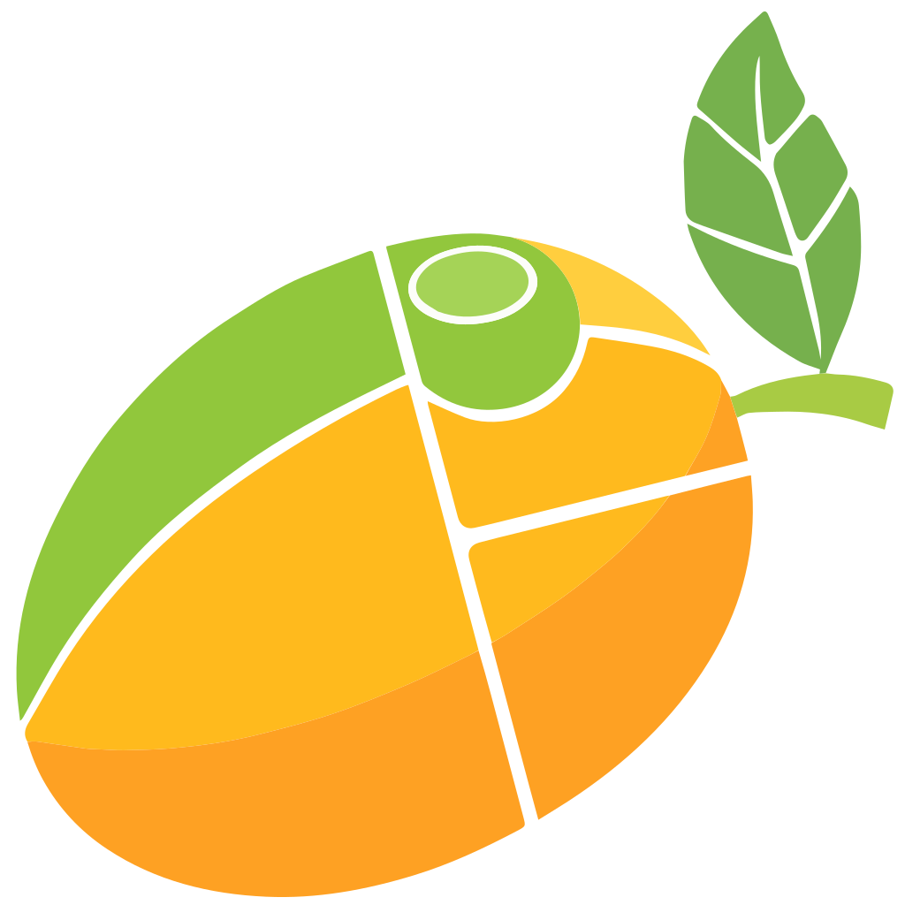

#  mango website

# GITHUB

This is the website for **[mango](https://github.com/mangowm/mango)** — a lightweight, high-performance Wayland compositor built on **dwl**.
This site provides detailed documentation, configuration guides, and developer resources for both users and contributors.

---

## ⚙️ Installation

> **Note:** This project uses [**Bun**](https://bun.com/) as the preferred package manager for its speed and modern features.

### 1. Clone the repository

```bash
git clone https://github.com/mangowm/mango-web.git
cd mango-web
```

### 2. Install dependencies

```bash
bun install
```

---

## 🚀 Development

### Start the development server

```bash
bun run dev
```

Once running, open [http://localhost:3001](http://localhost:3001) in your browser.

---

## 🧰 Available Scripts

| Command               | Description                                |
| --------------------- | ------------------------------------------ |
| `bun run dev`         | Start the local development server         |
| `bun run build`       | Build the site for production              |
| `bun run check`       | Run linting and formatting using **Biome** |
| `bun run check-types` | Perform TypeScript type checking           |

---

## 🏗️ Project Structure

```
mango-web/
├── docs/                     # Markdown/MDX documentation content
├── apps/
│   └── web/                  # Main Next.js application
│       ├── src/
│       │   ├── app/          # Next.js App Router pages
│       │   ├── components/   # Shared UI components
│       │   └── lib/          # Configurations & utilities
│       └── public/           # Static assets
└── turbo.json                # Turborepo configuration
```

---

## 🌐 Links

* **Core Project:** [mangowm/mango](https://github.com/mangowm/mango)
* **Project Wiki:** [mangowm/mango](https://github.com/mangowm/mango/wiki)
* **Live Site:** [https://mangowm.github.io](https://mangowm.github.io)
